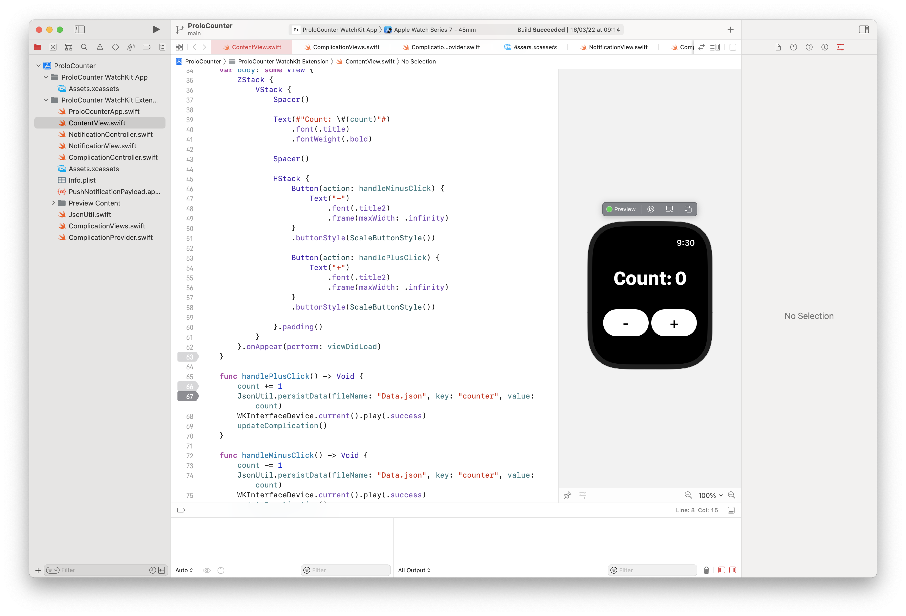

# Prolo Counter 

Prolo Counter is a very simple counter application, developed for WatchOS using SwiftUI.

<hr/>

## Some features

- Increment and decrement the counter with vibration feedback.

- Works offline, using a local JSON file to store data.

- Has a complication that shows the actual counter in the home screen of Apple Watch.

- Has a custom application icon.

To see more in action, take a look at the little demonstration video below.

<hr/>

Demo:


<hr/>

## Running

Just clone this repository with:

```bash
git clone https://github.com/andreprolo/ProloCounter.git
```

Open it in XCode:



And them you can select what Apple Watch simulator (or a physical one) you want to run the application.

> I developed specificaly for a Apple Watch Series 6 44mm. Others may not work fine!

<hr/>

<br/>

If you have any questions, contact me.

Thanks for reeding this.

<i>Author: André Prolo</i>